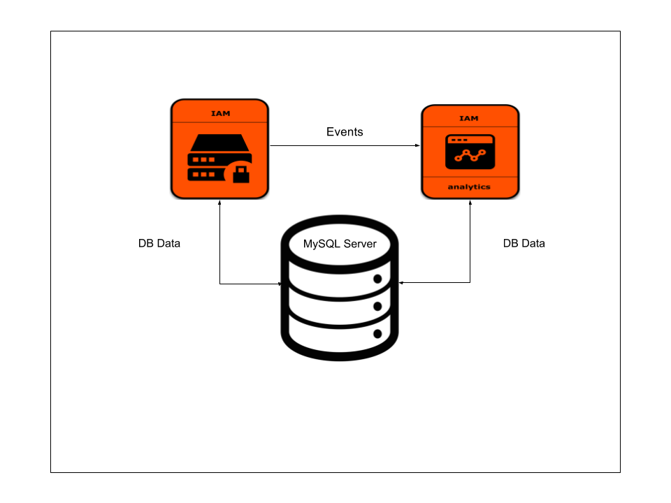

# WSO2 Identity Server with Analytics



Runs a pre configured Identity Server container and Identity Server Analytics container.

## Prerequisites

 * [Docker](https://www.docker.com/get-docker) and [Docker Compose](https://docs.docker.com/compose/install/#install-compose) are required for running this Docker Compose file.

## How to deploy

  1. Build WSO2 Identity Server and Identity Server Analytics Docker images using Dockerfiles,

     * [Identity Server Dockerfile](../../dockerfiles/is/README.md)
     * [Identity Server Analytics Dockerfile](../../dockerfiles/is-analytics/README.md)
     > In the `docker-compose.yml`, remove the `dockerhub.wso2.com/` prefix from the `image` name
        
     > For example, change the line `image: dockerhub.wso2.com/wso2is-analytics:5.4.0` to `image: wso2is-analytics:5.4.0`
  2. Pull MySQL Docker image:
     ```
     docker pull mysql:5.7.20
     ```

  3. Download the latest Identity Server Docker resources release zip file from the [releases](https://github.com/wso2/docker-is/releases) page or clone this repository to your local machine and switch to the latest tag.
  
  > Note that the local copy of `docker-is` repository will be referred to as `[docker-is]` from this point onwards.

  4. Switch to the docker-compose/is-analytics folder:
     ```
     cd [docker-is]/docker-compose/IS-with-ANALYTICS
     ```

  5. Execute the following Docker Compose command to start the deployment:
     ```
     docker-compose up
     ```

  6. Once the deployment process is complete add a host entry pointing to the Docker host machine IP address. For an example if the Docker host is accessible via 127.0.0.1 on a Linux or Mac machine, add the following entry in /etc/hosts file:

     ```
     127.0.0.1 wso2is
     127.0.0.1 wso2is-analytics
     ```

  7. Access the Identity Server carbon console using the below URL via a web browser:
     ```
     https://wso2is:9443/carbon
     ```
  8. Access the Identity Server Analytics portal using the below URL via a web browser:
     ```
     https://wso2is-analytics:9444/portal/dashboards/IsAnalytics-AuthenticationData/
     ```

  9. When configuring an application with Identity Server, use the following properties
      * IdPEntityId - wso2is
