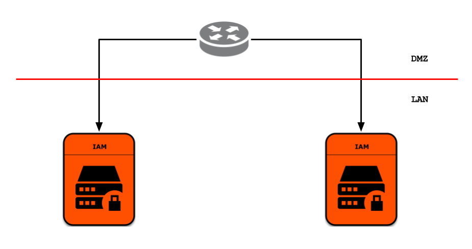

# WSO2 Identity Server Deployment Pattern 1



Identity Server pattern 1 includes two identity server instances fronted with a load balancer. Identity server nodes would need clustering and can be dynamically scaled according to the capacity requirements.

## Prerequisites

 * [Docker](https://www.docker.com/get-docker) and [Docker Compose](https://docs.docker.com/compose/install/#install-compose) are required for running this Docker Compose template.

## Quick Start Guide

  1. Pull Identity Server Docker image or build it using its [Dockerfile](../../dockerfile/README.md):
     ```
     docker pull wso2is:5.3.0
     ```

  2. Pull MySQL and HAProxy Docker images:
     ```
     docker pull mysql:5.7.19
     docker pull dockercloud/haproxy:1.6.3
     ```

  3. Download the latest Identity Server Docker resources release zip file from the [releases](https://github.com/wso2/docker-is/releases) page or clone this repository and switch to the latest tag.

  4. Switch to the docker-compose/pattern-1 folder:
     ```
     cd [docker-is]/docker-compose/pattern-1
     ```

  5. Execute the following Docker Compose command to start the deployment:
     ```
     docker-compose up
     ```

  6. Once the deployment process is complete add a host entry pointing to the Docker host machine IP address. For an example if the Docker host is accessible via 127.0.0.1 on a Linux or Mac machine, add the following entry in /etc/hosts file:

     ```
     127.0.0.1 wso2is
     ```

  7. Access the Identity Server carbon console using the below URL via a web browser:
     ```
     https://wso2is/carbon
     ```